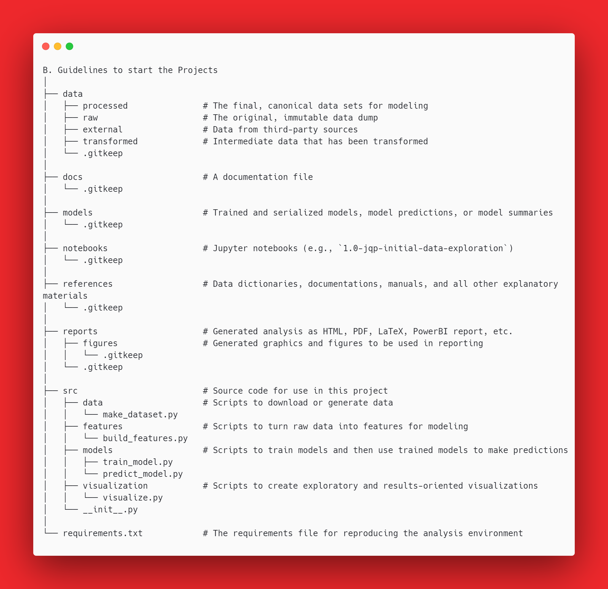
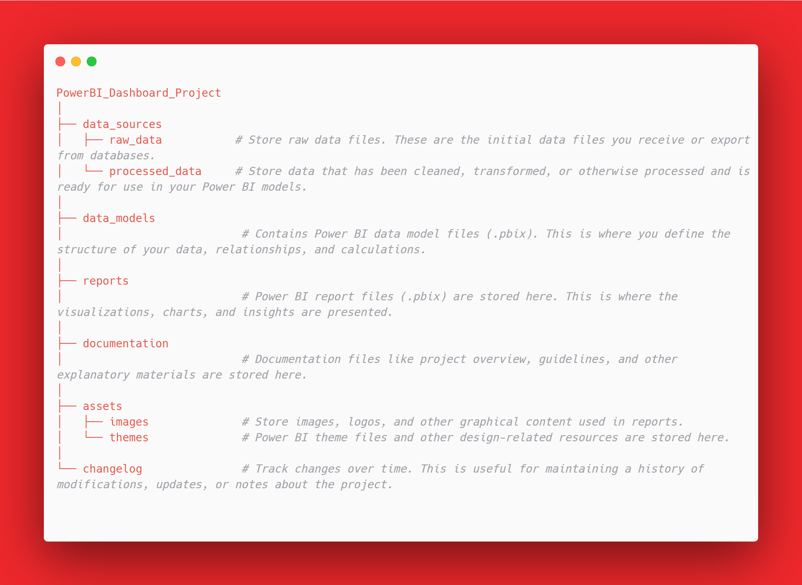

# Setup Guidelines for Data Science Project & PowerBI Dashboard Project

In this README.md you will learn how to use the setup script on how to AUTOMATE the creations project directories. 

This script provide well structured to create a well-organized Data Science project directory. It cover 2 sections below:-

            1. DS Project

            2. PowerBi-Dashboard-Projects

# ✍🏻 Table of Contents
- [Setup Guidelines for Data Science Project \& PowerBI Dashboard Project](#setup-guidelines-for-data-science-project--powerbi-dashboard-project)
- [✍🏻 Table of Contents](#-table-of-contents)
  - [A - Setup Data Science Project Directory](#a---setup-data-science-project-directory)
    - [Understand the Project Directory](#understand-the-project-directory)
  - [B - Setup PowerBi Dashboard Project Directory](#b---setup-powerbi-dashboard-project-directory)
    - [Understand the Project Directory](#understand-the-project-directory-1)

## A - Setup Data Science Project Directory

    Before starting the project, setup the repositories as below:

    Step 1: Create a File for the Project inside **C:\Users\hayat\HAYAT TECHNOLOGIES SDN BHD\Data Science - General\[2024] Data Science Projects\D. DS Projects**

    Step 2: Copy *setup-ds-project.py* from **C:\Users\hayat\HAYAT TECHNOLOGIES SDN BHD\Data Science - General\[2024] Data Science Projects\B. Guidelines to start the Projects**

    Step 3: Run the script with your command promps or VS Code 

### Understand the Project Directory

After running this script, the structure of the project directory would look like this:

1. Each folder contains a *.gitkeep* file. This is a placeholder file used to include otherwise empty directories in a Git repository.
2. The *src* directory is structured to contain all the source code for the project, organized into subdirectories for data processing, feature building, modeling, and visualization.
3. The *root* of the project directory contains a *requirements.txt* file, which is typically used to list all of the Python dependencies required to run the project.

 

## B - Setup PowerBi Dashboard Project Directory

    Before starting the project, setup the repositories as below:

    Step 1: Create a File for the Project inside **C:\Users\hayat\HAYAT TECHNOLOGIES SDN BHD\Data Science - General\[2024] Data Science Projects\E. PowerBi-Dashboard-Projects**

    Step 2: Copy *setup-powerbi-project.py* from **C:\Users\hayat\HAYAT TECHNOLOGIES SDN BHD\Data Science - General\[2024] Data Science Projects\B. Guidelines to start the Projects**

    Step 3: Run the script with your command promps or VS Code 

### Understand the Project Directory

After running this script, the structure of the project directory would look like this:

1. data_sources: This is the root directory for all data-related content.

     - **raw_data:** This subdirectory is intended for storing the original, unprocessed data. Keeping raw data in its original form ensures that you have a baseline to refer back to and prevents any loss of information due to preprocessing or transformation.
     - **processed_data:** This subdirectory is for data that has been cleaned, transformed, or processed in any way and is ready to be used in your Power BI models.

2. data_models: This directory contains the Power BI data model files. These files define the structure of your data, the relationships between different tables, and any calculations or measures that are part of the model. This is the backbone of your Power BI project.

3. reports: This directory holds the actual Power BI report files. This is where you craft the visualizations and arrange them into interactive reports that provide insights and allow users to explore the data.

4. documentation: This directory is for all your documentation needs. It can include a project overview, development guidelines, user manuals, or any other explanatory material that helps understand the project setup, its objectives, and how to use the reports.

5. assets: This is a general directory for storing additional resources.

     - **images:** This subdirectory can be used to store any images, logos, or other graphical content that you use in your Power BI reports.
     - **themes:** This subdirectory is for storing Power BI theme files or other design-related resources, helping you maintain a consistent look and feel across your reports.

6. changelog: This directory is for maintaining a record of changes, updates, or important notes about the project. It's useful for tracking the evolution of your project, especially when working in a team or for long-term projects.

The structure is designed to keep the project organized, making it easier to manage, maintain, and understand, especially as it grows or if multiple people are involved.

***Created On: 30th January 2024***

***Last Updated On: 09th July 2024***

***Created By: Sulaiha Subi***